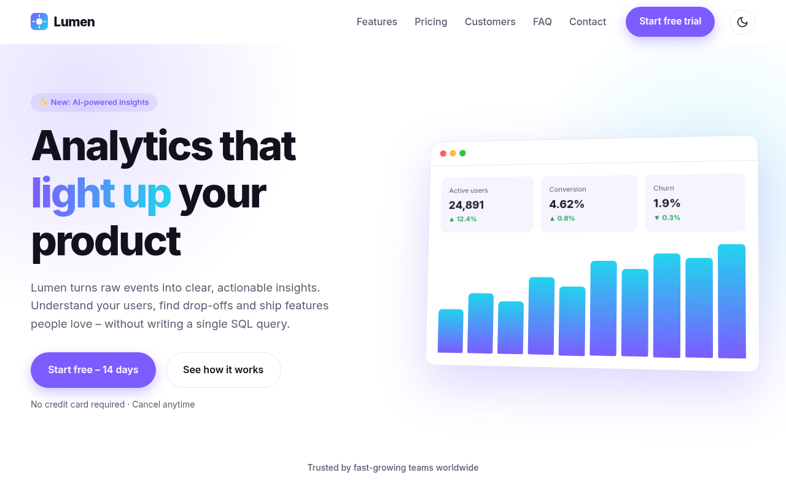
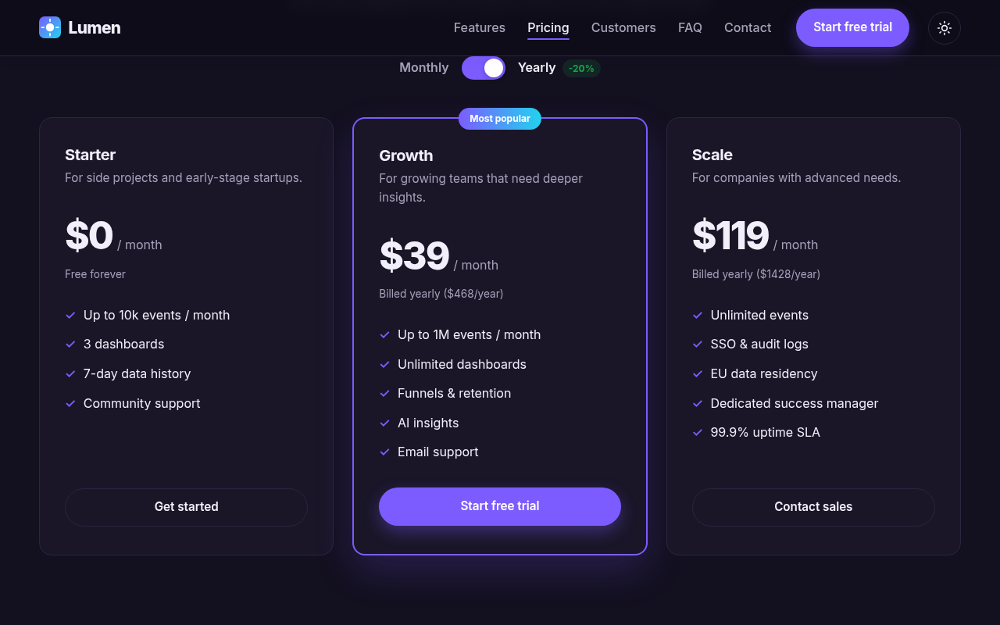
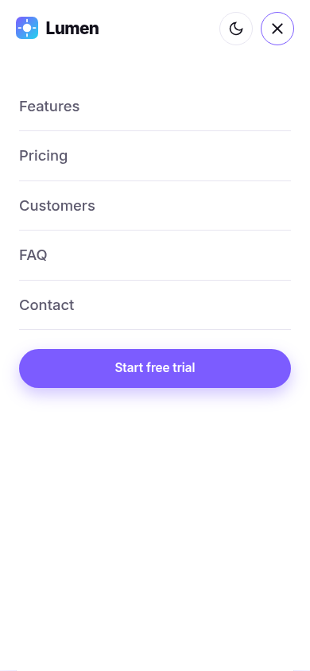

# ☀️ Lumen – SaaS Landing Page

A modern, fully responsive landing page for **Lumen**, a fictional product-analytics SaaS. Built with **pure HTML, CSS and vanilla JavaScript** – no frameworks, no build step – and ready to deploy on **GitHub Pages** as-is.

> Portfolio project by **Amir Namvar** – full-stack web developer.

**Live demo:** `https://som-info.github.io/lumen-landing/` _(available after enabling GitHub Pages – see below)_

---

## ✨ Features

- **Hero section** with gradient headline, CTAs and an animated dashboard mock built entirely in HTML/CSS.
- **Features grid** with hover effects.
- **Pricing table** with a **monthly / yearly toggle** (accessible switch, prices swapped from `data-*` attributes, yearly totals calculated automatically).
- **Testimonials** cards.
- **FAQ accordion** – keyboard accessible, smooth height animation, one item open at a time.
- **Contact form** with **client-side validation** (on blur + live re-validation, inline error messages, `aria-invalid`, focus on first error, success state).
- **Mobile navigation** – animated hamburger, slide-in menu, closes on link click / Escape / resize.
- **Dark / light mode** – respects `prefers-color-scheme`, remembers the choice in `localStorage`, no flash on load.
- **Scroll effects** – reveal-on-scroll animations, sticky header with shadow, active nav link highlighting.
- **Accessibility** – semantic HTML, skip link, visible focus states, ARIA attributes, `prefers-reduced-motion` support.
- **SEO basics** – meta description, Open Graph tags, SVG favicon.

## 🛠 Tech Stack

- **HTML5** – semantic markup
- **CSS3** – custom properties (theming), Grid, Flexbox, `color-mix()`, `clamp()`, media queries
- **JavaScript (ES2020)** – vanilla, no dependencies; `IntersectionObserver`, `localStorage`, `matchMedia`

## 📸 Screenshots

> _Screenshots live in `docs/screenshots/` – replace them with your own as the design evolves._

| Light – Hero | Dark – Pricing | Mobile Menu |
|--------------|----------------|-------------|
|  |  |  |

## 🚀 Getting Started

No installation or build step is required.

```bash
git clone https://github.com/som-info/lumen-landing.git
cd lumen-landing
```

Then either open `index.html` directly in your browser, or serve the folder locally (recommended):

```bash
# Python 3
python -m http.server 8000
# or Node.js
npx serve .
```

Visit <http://localhost:8000>.

### Deploy to GitHub Pages

1. Push the repository to GitHub.
2. Go to **Settings → Pages**.
3. Under **Build and deployment**, choose **Deploy from a branch**, select `main` and `/ (root)`, then **Save**.
4. Your site will be live at `https://<username>.github.io/lumen-landing/` within a minute or two.

All asset paths are relative, and a `.nojekyll` file is included, so the site works from a sub-path without any changes.

### Customisation

- **Colours & theme** – edit the design tokens at the top of `css/styles.css` (`--primary`, `--accent`, light/dark palettes).
- **Prices** – change the `data-monthly` / `data-yearly` attributes on each `.plan__amount` in `index.html`.
- **Form submission** – the form is validated client-side and simulates sending. To receive real messages, point it at a service such as Formspree or Netlify Forms in the submit handler in `js/main.js`.

## 📁 Project Structure

```
lumen-landing/
├── assets/
│   └── favicon.svg         # logo / favicon
├── css/
│   └── styles.css          # all styles, organised into numbered sections
├── js/
│   └── main.js             # theme, nav, pricing toggle, FAQ, form validation, reveal
├── docs/screenshots/       # README images
├── index.html              # single-page markup
├── .nojekyll               # serve files as-is on GitHub Pages
├── LICENSE
└── README.md
```

## 🌐 Browser Support

Latest versions of Chrome, Edge, Firefox and Safari (uses `color-mix()` – supported in all evergreen browsers since 2023).

## 📄 License

This project is licensed under the [MIT License](LICENSE). Avatar images are loaded from [pravatar.cc](https://pravatar.cc) placeholders; Lumen and all company names are fictional.

---

Made with ❤️ by [Amir Namvar](https://github.com/som-info)
